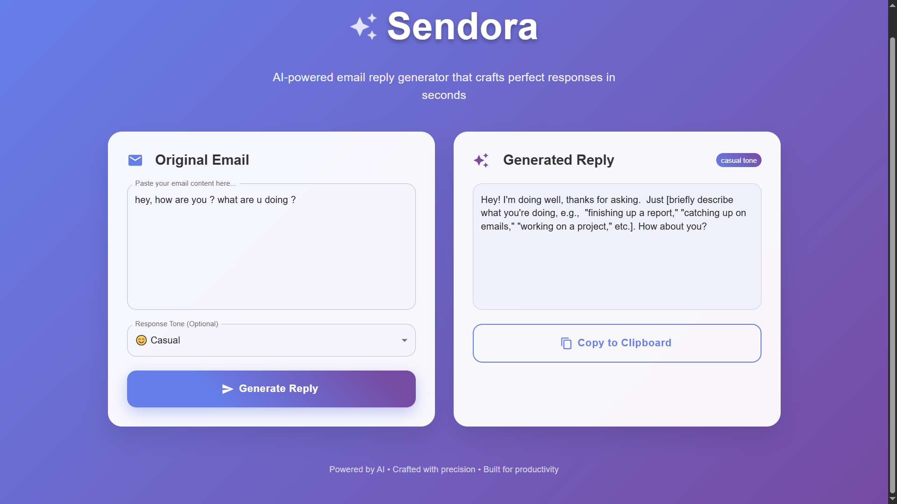

<h1>✨ Sendora: Your AI-Powered Email Reply Sidekick</h1>
<blockquote>

Revolutionize your inbox with intelligent email replies powered by Google Gemini AI

</blockquote>

Sendora is a full-stack application that intelligently generates professional email replies using cutting-edge AI technology. Built with Spring Boot backend, React frontend, and seamless Chrome Extension integration, Sendora eliminates writer's block and streamlines your email communication.

<h2>📸 Screenshots</h2>
<h3>React Frontend Interface</h3>

<em>Clean and intuitive interface for generating AI-powered email replies</em>

<h3>Chrome Extension in Action</h3>

.png)
<em>Seamlessly integrated into Gmail for instant reply generation</em>

<h3>Gmail Interface</h3>

.png)
<em>Complete overview of Sendora's powerful features</em>

<h2>🌟 Features</h2>
<ul>
<li><strong>🤖 AI-Powered Replies</strong>: Generate contextually relevant and grammatically perfect email responses using Google Gemini AI</li>
<li><strong>✍️ Customizable Tone</strong>: Choose from professional, friendly, formal, or concise tones to match your communication style</li>
<li><strong>📧 Seamless Integration</strong>: Chrome Extension enables direct reply generation from your favorite webmail clients like Gmail</li>
<li><strong>🛡️ Secure Backend</strong>: Robust Spring Boot backend ensures fast and secure AI API calls</li>
<li><strong>🚀 Modern UI</strong>: Responsive and intuitive React frontend for an exceptional user experience</li>
</ul>
<h2>🏗️ Architecture</h2>
<pre><code class="language-mermaid">graph TD
    A[React Frontend&lt;br/&gt;localhost:5173] --&gt;|POST /api/email/generate| B[Spring Boot Backend&lt;br/&gt;localhost:8080]
    C[Chrome Extension] --&gt;|POST /api/email/generate| B
    B --&gt;|API Call| D[Google Gemini API&lt;br/&gt;gemini-1.0-pro]
    D --&gt;|AI Response| B
    B --&gt;|Generated Reply| A
    B --&gt;|Generated Reply| C
</code></pre>
<h3>Components</h3>
<ul>
<li><strong>React Frontend</strong> (<code>localhost:5173</code>): Clean interface for email content input and tone selection</li>
<li><strong>Spring Boot Backend</strong> (<code>localhost:8080</code>): REST API that processes requests and communicates with Gemini AI</li>
<li><strong>Chrome Extension</strong>: In-browser assistant for seamless webmail integration</li>
<li><strong>Google Gemini API</strong>: Large language model powering intelligent email generation</li>
</ul>
<h2>🚀 Quick Start</h2>
<h3>Prerequisites</h3>
<ul>
<li>Java Development Kit (JDK) 17+</li>
<li>Maven 3.6+</li>
<li>Node.js 18+ and npm (or Yarn)</li>
<li>Google Cloud Project with Generative Language API enabled</li>
<li>Google Gemini API Key</li>
</ul>
<h3>1. Backend Setup</h3>
<pre><code class="language-bash"># Clone the repository
git clone https://github.com/your-username/Sendora.git
cd Sendora/backend

# Configure API key in src/main/resources/application.properties
# Replace YOUR_GEMINI_API_KEY_HERE with your actual API key
</code></pre>

<strong>application.properties</strong>:

<pre><code class="language-properties">spring.application.name=Sendora
gemini.api.url=https://generativelanguage.googleapis.com/v1beta/models/gemini-1.0-pro:generateContent?key=
gemini.api.key=YOUR_GEMINI_API_KEY_HERE
</code></pre>
<pre><code class="language-bash"># Build and run
mvn clean install
mvn spring-boot:run
</code></pre>
<h3>2. Frontend Setup</h3>
<pre><code class="language-bash"># Navigate to frontend directory
cd ../frontend

# Install dependencies
npm install
# or yarn install

# Start development server
npm run dev
# or yarn dev
</code></pre>
<h3>3. Chrome Extension Setup</h3>
<pre><code class="language-bash"># Navigate to extension directory
cd ../chrome-extension
</code></pre>

<strong>Load in Chrome</strong>:

<ol>
<li>Open <code>chrome://extensions</code></li>
<li>Enable "Developer mode"</li>
<li>Click "Load unpacked" and select the <code>chrome-extension</code> folder</li>
</ol>
<h2>🎯 Usage</h2>
<h3>React Frontend</h3>
<ol>
<li>Open <code>http://localhost:5173</code></li>
<li>Enter your email content</li>
<li>Select desired tone (optional)</li>
<li>Click "Generate Reply"</li>
<li>Copy your AI-generated response</li>
</ol>
<h3>Chrome Extension</h3>
<ol>
<li>Navigate to Gmail or your preferred webmail</li>
<li>Look for Sendora's UI elements</li>
<li>Click the Sendora button to generate contextual replies</li>
<li>Use the generated text directly in your email</li>
</ol>
<h2>🐛 Troubleshooting</h2>
<h3>Common Issues</h3>

<strong>Backend Logs</strong>: Check Spring Boot console for detailed error messages

<ul>
<li>Look for: <code>WebClient error calling Gemini API: Status - [CODE], Response Body - [JSON_ERROR_MESSAGE]</code></li>
</ul>

<strong>CORS Errors</strong>: Ensure your <code>EmailGenerator</code> controller includes:

<pre><code class="language-java">@CrossOrigin(origins = {"http://localhost:5173", "chrome-extension://*"})
</code></pre>

<strong>API Key Issues</strong>:

<ul>
<li>Verify key has Generative Language API access</li>
<li>Check for typos in <code>application.properties</code></li>
<li>Ensure billing is enabled in Google Cloud Console</li>
</ul>

<strong>Network Issues</strong>:

<ul>
<li>Confirm backend is running on <code>localhost:8080</code></li>
<li>Check browser Network tab for request/response details</li>
<li>Verify model name is <code>gemini-1.0-pro</code></li>
</ul>
<h2>🌟 Roadmap</h2>
<ul>
<li>[ ] <strong>Streaming Responses</strong>: Real-time text generation</li>
<li>[ ] <strong>User Authentication</strong>: Secure user accounts and reply history</li>
<li>[ ] <strong>Enhanced Error Handling</strong>: User-friendly error messages</li>
<li>[ ] <strong>Smart Context Detection</strong>: Improved Chrome Extension intelligence</li>
<li>[ ] <strong>Advanced Gemini Features</strong>: Function calling and richer interactions</li>
</ul>
<h2>🤝 Contributing</h2>

We welcome contributions! Please feel free to submit issues, feature requests, or pull requests.

<ol>
<li>Fork the repository</li>
<li>Create your feature branch (<code>git checkout -b feature/AmazingFeature</code>)</li>
<li>Commit your changes (<code>git commit -m 'Add some AmazingFeature'</code>)</li>
<li>Push to the branch (<code>git push origin feature/AmazingFeature</code>)</li>
<li>Open a Pull Request</li>
</ol>
<h2>📄 License</h2>

This project is licensed under the MIT License - see the <a href="LICENSE">LICENSE</a> file for details.

<h2>🙏 Acknowledgments</h2>
<ul>
<li>Google Gemini AI for powering intelligent email generation</li>
<li>Spring Boot and React communities for excellent frameworks</li>
<li>Chrome Extension developers for seamless browser integration</li>
</ul>

<strong>Built with ❤️ by the Team</strong>

<em>Transform your email experience today with AI-powered communication!</em>

